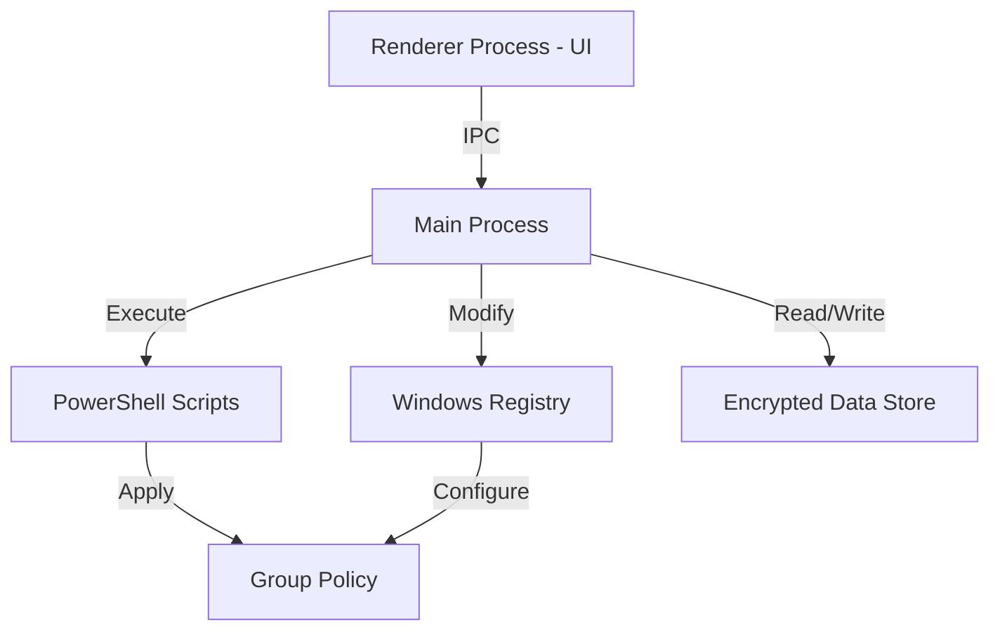

# Design Document - Group Policy Manager

## Overview

The Group Policy Manager (GPM) is an Electron.js desktop application for Windows that provides a modern interface for managing Group Policy settings. The application uses Node.js child processes to execute PowerShell scripts and Windows registry modifications to control external drive access and browser website restrictions.

### Technology Stack

- **Frontend**: Electron.js with HTML/CSS/JavaScript
- **UI Framework**: Modern CSS with custom components (or React if preferred)
- **Backend**: Node.js with Electron's main process
- **System Integration**: PowerShell scripts and Windows Registry API
- **Data Storage**: Encrypted local JSON file for credentials and settings
- **Security**: bcrypt for password hashing, crypto module for encryption

## Architecture

### Application Structure

```
group-policy-manager/
├── main.js                 # Electron main process
├── preload.js             # Secure IPC bridge
├── renderer/
│   ├── index.html         # Main application UI
│   ├── login.html         # Login screen
│   ├── styles/
│   │   └── main.css       # Modern UI styles
│   └── scripts/
│       ├── renderer.js    # Main UI logic
│       └── login.js       # Login logic
├── src/
│   ├── auth/
│   │   ├── authManager.js        # Authentication logic
│   │   └── passwordManager.js    # Password operations
│   ├── policy/
│   │   ├── policyManager.js      # Group policy orchestration
│   │   ├── drivePolicy.js        # External drive policies
│   │   └── browserPolicy.js      # Browser/website policies
│   ├── storage/
│   │   └── dataStore.js          # Encrypted data persistence
│   └── utils/
│       ├── privilegeChecker.js   # Admin privilege verification
│       └── logger.js             # Application logging
└── package.json
```

### Process Architecture



## Components and Interfaces

### 1. Authentication System

#### AuthManager (`src/auth/authManager.js`)

**Responsibilities:**
- Validate user credentials
- Manage authentication sessions
- Handle login/logout operations

**Key Methods:**
```javascript
class AuthManager {
  async authenticate(username, password)
  async logout()
  isAuthenticated()
  getCurrentUser()
}
```

#### PasswordManager (`src/auth/passwordManager.js`)

**Responsibilities:**
- Hash and verify passwords using bcrypt
- Handle password changes
- Manage security questions and answers
- Validate developer key
- Provide security question setup interface

**Key Methods:**
```javascript
class PasswordManager {
  async changePasswordWithOld(oldPassword, newPassword)
  async changePasswordWithSecurityQuestion(answer, newPassword)
  async changePasswordWithDeveloperKey(key, newPassword)
  async setSecurityQuestion(question, answer)
  async getSecurityQuestion()
  async hasSecurityQuestion()
  validatePasswordStrength(password)
}
```

### 2. Policy Management System

#### PolicyManager (`src/policy/policyManager.js`)

**Responsibilities:**
- Coordinate policy operations
- Check administrator privileges
- Handle policy application errors
- Reset all policies to default state
- Synchronize policy states on startup

**Key Methods:**
```javascript
class PolicyManager {
  async checkAdminPrivileges()
  async applyPolicy(policyType, settings)
  async getCurrentPolicyStatus()
  async resetAllPolicies()
  async syncPolicyStates()
}
```

#### DrivePolicy (`src/policy/drivePolicy.js`)

**Responsibilities:**
- Block/unblock write access to removable drives
- Modify registry keys for removable storage policies

**Implementation Approach:**
- Modify registry key: `HKEY_LOCAL_MACHINE\SYSTEM\CurrentControlSet\Control\StorageDevicePolicies`
- Set `WriteProtect` DWORD value: 1 (block) or 0 (allow)

**Key Methods:**
```javascript
class DrivePolicy {
  async blockWriteAccess()
  async allowWriteAccess()
  async getWriteAccessStatus()
}
```

#### BrowserPolicy (`src/policy/browserPolicy.js`)

**Responsibilities:**
- Block all websites across browsers
- Block browser internal settings pages
- Manage domain whitelist
- Apply browser-specific policies
- Track and report blocked/whitelisted domains

**Implementation Approach:**
- Use Windows Group Policy registry keys for each browser
- Chrome: `HKEY_LOCAL_MACHINE\SOFTWARE\Policies\Google\Chrome`
- Firefox: `HKEY_LOCAL_MACHINE\SOFTWARE\Policies\Mozilla\Firefox`
- Edge: `HKEY_LOCAL_MACHINE\SOFTWARE\Policies\Microsoft\Edge`
- Apply URLBlocklist and URLAllowlist policies
- Block internal pages: chrome://, edge://, about: URLs

**Key Methods:**
```javascript
class BrowserPolicy {
  async blockAllWebsites()
  async unblockAllWebsites()
  async blockBrowserInternalPages()
  async unblockBrowserInternalPages()
  async enableWhitelist(domains)
  async disableWhitelist()
  async addDomain(domain)
  async removeDomain(domain)
  async getDomainList()
  async getBlockedDomains()
  validateDomain(domain)
}
```

### 3. Data Storage System

#### DataStore (`src/storage/dataStore.js`)

**Responsibilities:**
- Persist application data securely
- Encrypt sensitive information
- Store user credentials, security questions, and settings

**Data Structure:**
```javascript
{
  credentials: {
    username: "admin",
    passwordHash: "bcrypt_hash",
    securityQuestion: "encrypted_question",
    securityAnswerHash: "bcrypt_hash",
    hasSecurityQuestion: false
  },
  developerKey: "encrypted_key",
  settings: {
    driveBlockEnabled: false,
    websiteBlockEnabled: false,
    whitelistEnabled: false,
    whitelistedDomains: [],
    blockedDomains: []
  },
  toggleStates: {
    driveBlock: false,
    websiteBlock: false,
    whitelist: false,
    lastSynced: null
  }
}
```

**Key Methods:**
```javascript
class DataStore {
  async load()
  async save(data)
  async getCredentials()
  async updateCredentials(credentials)
  async getSettings()
  async updateSettings(settings)
}
```

### 4. Logging System

#### Logger (`src/utils/logger.js`)

**Responsibilities:**
- Write log entries to file system
- Manage log file rotation
- Support different log levels (debug, info, warn, error)
- Format log entries with timestamps and context
- Separate development and production logging

**Implementation Approach:**
- Use Winston or similar logging library
- Store logs in application data directory
- Rotate logs when they exceed 10MB
- Keep last 5 log files
- Log format: `[timestamp] [level] [component] message`

**Key Methods:**
```javascript
class Logger {
  debug(message, context)
  info(message, context)
  warn(message, context)
  error(message, error, context)
  logAuthAttempt(username, success)
  logPolicyChange(policyType, action, success)
  logAppEvent(event, details)
}
```

**Log Directory:**
- Development: `./logs/`
- Production: `%APPDATA%/group-policy-manager/logs/`

### 5. UI Components

#### Login Screen (`renderer/login.html`)

**Features:**
- Username and password input fields
- Login button
- Password recovery options (modal/dialog)
- Error message display

#### Main Application Screen (`renderer/index.html`)

**Layout Sections:**
1. **Header**: Application title, logout button, reset all policies button
2. **External Drive Control Panel**:
   - Toggle switch for write access blocking
   - Status indicator
   - Information text: "Read access remains enabled"
3. **Website Control Panel**:
   - Toggle switch for blocking all websites
   - Toggle switch for whitelist mode
   - Domain management interface (add/remove domains)
   - Blocked domains list display (when block all is enabled)
   - Whitelisted domains list display (when whitelist is enabled)
   - Empty state messages for lists
4. **Settings Panel**:
   - Change password button
   - Security question setup/management button
   - View logs button (optional)

**Toggle Switch Component:**
```html
<div class="toggle-container">
  <label class="toggle-label">Block External Drive Write Access</label>
  <label class="switch">
    <input type="checkbox" id="driveBlockToggle">
    <span class="slider"></span>
  </label>
  <span class="status-indicator">Disabled</span>
</div>
```

**Domain List Component:**
```html
<div class="domain-list-container">
  <h3>Whitelisted Domains</h3>
  <div class="domain-list" id="whitelistDisplay">
    <div class="domain-item">
      <span class="domain-name">example.com</span>
      <button class="remove-btn" data-domain="example.com">Remove</button>
    </div>
    <!-- Empty state -->
    <div class="empty-state" style="display: none;">
      No domains in whitelist
    </div>
  </div>
</div>
```

**Reset Confirmation Modal:**
```html
<div class="modal" id="resetModal">
  <div class="modal-content">
    <h2>Reset All Policies</h2>
    <p>This will disable all group policies and restore default settings. Are you sure?</p>
    <div class="modal-actions">
      <button class="btn-cancel">Cancel</button>
      <button class="btn-confirm">Reset All</button>
    </div>
  </div>
</div>
```

**Security Question Setup Modal:**
```html
<div class="modal" id="securityQuestionModal">
  <div class="modal-content">
    <h2>Setup Security Question</h2>
    <form id="securityQuestionForm">
      <label>Security Question:</label>
      <input type="text" id="securityQuestion" placeholder="What is your favorite color?" required>
      <label>Answer:</label>
      <input type="text" id="securityAnswer" required>
      <div class="modal-actions">
        <button type="button" class="btn-cancel">Cancel</button>
        <button type="submit" class="btn-confirm">Save</button>
      </div>
    </form>
  </div>
</div>
```

## Data Models

### User Credentials Model
```javascript
{
  username: String,
  passwordHash: String,
  securityQuestion: String (encrypted),
  securityAnswerHash: String,
  createdAt: Date,
  lastModified: Date
}
```

### Application Settings Model
```javascript
{
  driveBlockEnabled: Boolean,
  websiteBlockEnabled: Boolean,
  whitelistEnabled: Boolean,
  whitelistedDomains: Array<String>,
  blockedDomains: Array<String>,
  lastUpdated: Date
}
```

### Toggle States Model
```javascript
{
  driveBlock: Boolean,
  websiteBlock: Boolean,
  whitelist: Boolean,
  lastSynced: Date
}
```

### Policy Status Model
```javascript
{
  driveWriteBlocked: Boolean,
  allWebsitesBlocked: Boolean,
  whitelistActive: Boolean,
  activeDomains: Array<String>,
  blockedDomains: Array<String>,
  internalPagesBlocked: Boolean
}
```

## Security Considerations

### Password Security
- Use bcrypt with salt rounds of 10 for password hashing
- Store developer key encrypted using AES-256
- Never store passwords in plain text

### Data Encryption
- Encrypt sensitive data at rest using Node.js crypto module
- Use a machine-specific key derived from hardware identifiers
- Encrypt security questions and answers

### IPC Security
- Use contextIsolation in Electron
- Implement preload script with limited API exposure
- Validate all IPC messages

### Privilege Escalation
- Check for administrator privileges on startup
- Prompt for UAC elevation if needed
- Validate privileges before each policy modification

## Error Handling

### Error Categories

1. **Authentication Errors**
   - Invalid credentials
   - Account locked
   - Password reset failures

2. **Policy Application Errors**
   - Insufficient privileges
   - Registry access denied
   - PowerShell execution failures

3. **Data Storage Errors**
   - File read/write failures
   - Encryption/decryption errors
   - Data corruption

### Error Handling Strategy

- Display user-friendly error messages in the UI
- Log detailed error information for debugging
- Implement retry logic for transient failures
- Gracefully degrade functionality when possible
- Provide clear recovery instructions

### Error Response Format
```javascript
{
  success: Boolean,
  error: {
    code: String,
    message: String,
    details: String,
    recoverable: Boolean
  }
}
```

## Testing Strategy

### Unit Testing
- Test authentication logic with various credential combinations
- Test password hashing and verification
- Test domain validation logic
- Test data encryption/decryption
- Mock registry and PowerShell operations

### Integration Testing
- Test IPC communication between main and renderer processes
- Test policy application with actual registry modifications (in test environment)
- Test data persistence and retrieval
- Test privilege checking

### Manual Testing
- Test UI responsiveness and visual feedback
- Test toggle switches with actual policy changes
- Test password recovery flows
- Test error scenarios (no admin rights, registry locked, etc.)
- Test on different Windows versions (Windows 10, Windows 11)

### Security Testing
- Verify password hashing strength
- Test encryption key security
- Verify IPC message validation
- Test privilege escalation handling
- Attempt to bypass authentication

## Implementation Notes

### Windows Registry Modifications

**External Drive Write Protection:**
```
Key: HKLM\SYSTEM\CurrentControlSet\Control\StorageDevicePolicies
Value: WriteProtect (DWORD)
Data: 1 (block) or 0 (allow)
```

**Browser Policy Examples:**

Chrome URLBlocklist:
```
Key: HKLM\SOFTWARE\Policies\Google\Chrome\URLBlocklist
Values: 1="*", 2="*://*", etc.
```

Chrome URLAllowlist:
```
Key: HKLM\SOFTWARE\Policies\Google\Chrome\URLAllowlist
Values: 1="example.com", 2="trusted.com", etc.
```

### PowerShell Integration

Execute PowerShell commands using Node.js child_process:
```javascript
const { exec } = require('child_process');
const command = `powershell -Command "Set-ItemProperty -Path 'HKLM:\\...' -Name 'WriteProtect' -Value 1"`;
exec(command, { shell: 'powershell.exe' }, callback);
```

### Developer Key Generation

Generate a secure developer key during initial setup:
```javascript
const crypto = require('crypto');
const developerKey = crypto.randomBytes(32).toString('hex');
```

Store this key securely and provide it to the developer for recovery purposes.

### Toggle State Persistence

**Implementation Strategy:**
1. Save toggle states to DataStore whenever they change
2. On application startup:
   - Load saved toggle states from DataStore
   - Query actual Group Policy registry settings
   - Synchronize UI with actual policy state
   - Update DataStore if discrepancies found

**Synchronization Logic:**
```javascript
async function syncToggleStates() {
  const savedStates = await dataStore.getToggleStates();
  const actualStates = await policyManager.getCurrentPolicyStatus();
  
  // Update UI to match actual policy state
  updateToggleUI('driveBlock', actualStates.driveWriteBlocked);
  updateToggleUI('websiteBlock', actualStates.allWebsitesBlocked);
  updateToggleUI('whitelist', actualStates.whitelistActive);
  
  // Save synchronized state
  await dataStore.updateToggleStates({
    driveBlock: actualStates.driveWriteBlocked,
    websiteBlock: actualStates.allWebsitesBlocked,
    whitelist: actualStates.whitelistActive,
    lastSynced: new Date()
  });
}
```

### Browser Internal Pages Blocking

**Chrome Internal Pages:**
```
chrome://settings
chrome://flags
chrome://extensions
chrome://apps
chrome://history
chrome://downloads
```

**Edge Internal Pages:**
```
edge://settings
edge://flags
edge://extensions
edge://apps
edge://history
edge://downloads
```

**Firefox Internal Pages:**
```
about:config
about:preferences
about:addons
about:support
```

**Registry Implementation:**
Add these URLs to the URLBlocklist when website blocking is enabled:
```
HKLM\SOFTWARE\Policies\Google\Chrome\URLBlocklist
  1 = "chrome://*"
  
HKLM\SOFTWARE\Policies\Microsoft\Edge\URLBlocklist
  1 = "edge://*"
  
HKLM\SOFTWARE\Policies\Mozilla\Firefox\WebsiteFilter\Block
  1 = "about:*"
```

### Reset All Policies Implementation

**Reset Process:**
1. Show confirmation modal
2. If confirmed:
   - Call `drivePolicy.allowWriteAccess()`
   - Call `browserPolicy.unblockAllWebsites()`
   - Call `browserPolicy.disableWhitelist()`
   - Clear whitelistedDomains and blockedDomains arrays
   - Set all toggle states to false
   - Save updated settings to DataStore
   - Update UI to reflect changes
   - Show success message

### Logging Implementation

**Log Entry Format:**
```
[2024-11-17 14:30:45] [INFO] [AuthManager] User 'admin' logged in successfully
[2024-11-17 14:31:12] [INFO] [DrivePolicy] External drive write access blocked
[2024-11-17 14:31:45] [ERROR] [BrowserPolicy] Failed to apply policy: Access denied
[2024-11-17 14:32:00] [INFO] [PolicyManager] All policies reset to default
```

**Log Rotation:**
- Max file size: 10MB
- Max files: 5
- Naming: `app-YYYY-MM-DD.log`
- Archived logs: `app-YYYY-MM-DD.1.log`, etc.

## UI Design Principles

1. **Clarity**: Clear labels and status indicators
2. **Feedback**: Immediate visual feedback for all actions
3. **Consistency**: Uniform styling and behavior across components
4. **Accessibility**: Keyboard navigation and screen reader support
5. **Modern Aesthetics**: Clean design with smooth animations

### Color Scheme
- Primary: #2563eb (blue)
- Success: #10b981 (green)
- Danger: #ef4444 (red)
- Background: #f9fafb (light gray)
- Text: #111827 (dark gray)

### Typography
- Font Family: 'Segoe UI', system-ui, sans-serif
- Headings: 24px, 600 weight
- Body: 14px, 400 weight
- Labels: 12px, 500 weight
